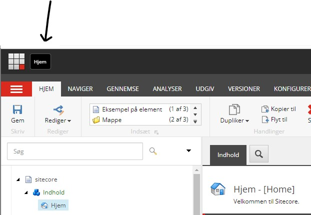
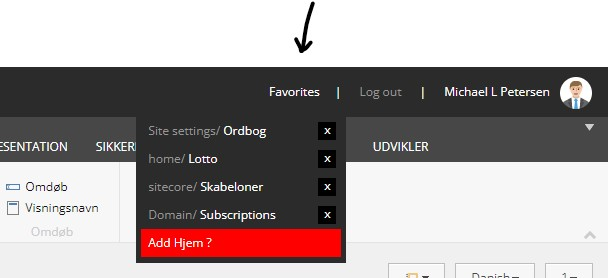
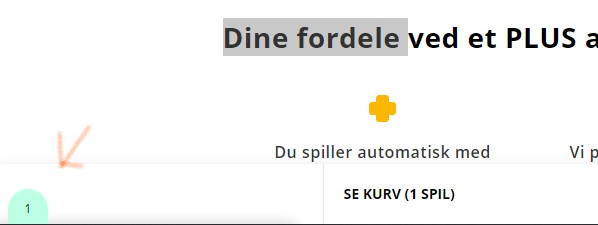
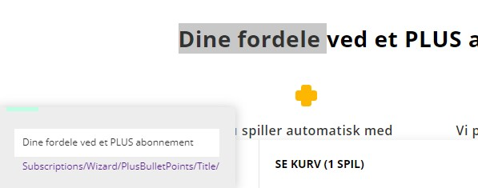
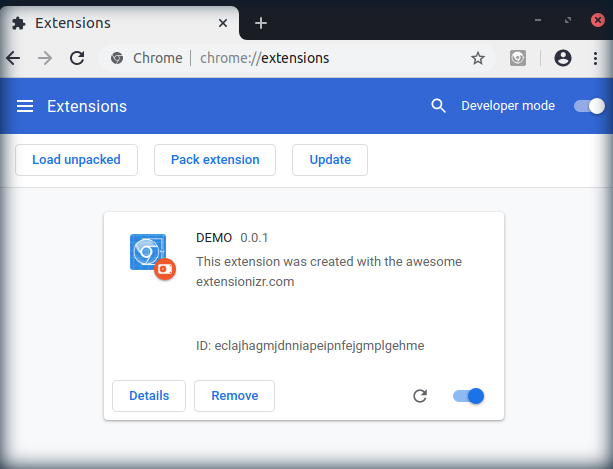

# Chrome extension for Sitecore

## To do
Add history tab next to "Favorites", that adds each item visited.

## Features

### Bookmark
The current node is added as a direct link. Click it to get a direct link to the current node, or drag it to the bookmarks bar for later reference.

### Favorites
The current node can be added to a favorites list.

### Find dictionaries
Highlight a text and get a direct link to its placement in dictionaries.

### Other features
Certain layout improvements have been added.

## Adding extension to Chrome

1. [Download](https://github.com/mikelothar/Chrome-Extension-For-Sitecore/releases) and unzip the latest version of this extension, or git clone this repository.
2. Open Chrome browser.
3. Navigate to `chrome://extensions`
4. Turn on the Developer mode switcher.

5. Load the unpacked version of where you downloaded this extension.

